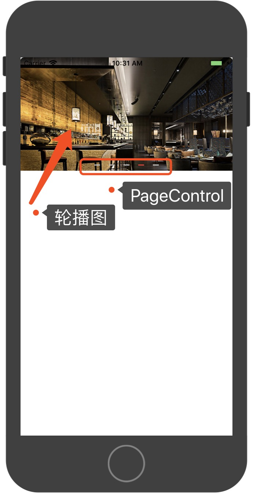

### PageControl

#### UIScrollView

<pre>
#pragma mark - lazy
- (UIScrollView *)scrollView{
    if (_scrollView == nil) {
        _scrollView = [[UIScrollView alloc]initWithFrame:CGRectMake(0, 0, Width, Height)];
        _scrollView.delegate = self;
        _scrollView.pagingEnabled=YES;
        _scrollView.showsHorizontalScrollIndicator = NO;
    }
    return _scrollView;
}

#pragma mark - UIScrollViewDelegate

- (void)scrollViewDidScroll:(UIScrollView *)scrollView{
    _page = scrollView.contentOffset.x / Width;
    self.pageControl.currentPage = _page;
}
// 防止按住图片而没有停止定时器

- (void)scrollViewWillBeginDragging:(UIScrollView *)scrollView{
    [self.time invalidate];
    self.time = nil;
}

- (void)scrollViewDidEndDragging:(UIScrollView *)scrollView willDecelerate:(BOOL)decelerate{
    self.time = [NSTimer scheduledTimerWithTimeInterval:2.0 target:self selector:@selector(CurrentPage) userInfo:nil repeats:YES];
}
</pre>

#### UIImageView
设置每页的图片

<pre>
- (void)setImageCount:(NSUInteger)count{
    for (int i = 0; i < count; i ++) {
        UIImageView * imageView = [[UIImageView alloc]initWithFrame:CGRectMake(i * Width, 0 , Width, Height)];
        imageView.image = [UIImage imageNamed:[NSString stringWithFormat:@"image%d",i+1]];
        [self.scrollView addSubview:imageView];
    }
    _count = count;
    self.pageControl.numberOfPages = _count;
    self.scrollView.contentSize = CGSizeMake(Width * _count, Height);
}
</pre>

#### UIPageControl

设置PageControl

<pre>
#pragma mark - lazy
- (UIPageControl *)pageControl{
    if (_pageControl == nil) {
        _pageControl = [[UIPageControl alloc]initWithFrame:CGRectMake(Width / 2.0 - 100, Height - 20, 200, 20)];
        _pageControl.backgroundColor = [UIColor clearColor];
        _pageControl.currentPage = 0;
        [_pageControl setValue:[UIImage imageNamed:@"gray"] forKeyPath:@"pageImage"];
        [_pageControl setValue:[UIImage imageNamed:@"red"] forKeyPath:@"currentPageImage"];
    }
    return _pageControl;
}
</pre>

####  NSTimer

设置定时器轮播

<pre>
#pragma mark - NSTimer
- (void)startNSTimer{
    self.time = [NSTimer timerWithTimeInterval:2.0 target:self selector:@selector(CurrentPage) userInfo:nil repeats:YES];
    [[NSRunLoop currentRunLoop] addTimer:self.time forMode:NSDefaultRunLoopMode];
}
- (void)endNSTimer{
    [self.time invalidate];
    self.time = nil;
}
- (void)CurrentPage{
    self.pageControl.currentPage = _page;
    [self.scrollView setContentOffset:CGPointMake(Width * _page, 0)];
    
    if (_page == 4) {
        _page = 0;
    }else{
        _page ++;
    }
}
</pre>
